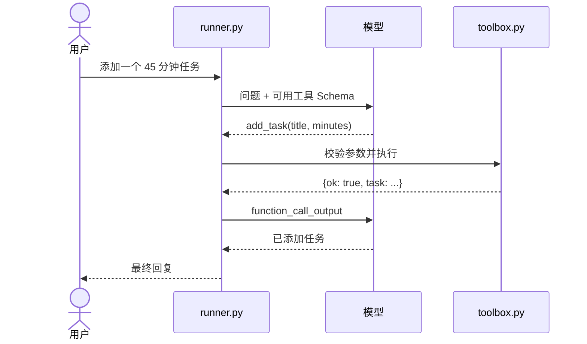

# Agent Developer Internship Roadmap · 8 Week Lab

> **学习路线：Week 01–08。** 已有开发经验、每周约 20 小时可按本仓库推进；第 4 周开始投递实习。所有离线示例无需 API Key，真实模型路径保留为可选功能。

## 从哪里开始

| 阶段 | 核心内容 | 无密钥入口 |
| --- | --- | --- |
| [Week 01](docs/week01.md) | 工具调用 | `python -m study_agent demo` |
| [Week 02](docs/week02.md) | 多轮状态 | `python -m study_agent demo-session` |
| [Week 03–04](projects/doc_qa/README.md) | 文档问答与检索评测 | `python -m projects.doc_qa "忘记密码怎么重置？"` |
| [Week 05–06](projects/issue_triage/README.md) | Issue 分诊与人工批准 | `python -m projects.issue_triage 101` |
| [Week 07–08](docs/week07.md) | 评测、简历与面试 | 两个项目的 `eval.py`、[Week 08](docs/week08.md) |

完整安排见 [8 周路线图](docs/roadmap.md)，按阶段筛选的热门开源示例见 [开源项目索引](docs/open-source-projects.md)。本仓库保留第 1 周的独立教程，方便从最小 Agent 循环读起。

## Week 01 · 学习任务管理 Agent

项目实现一个**学习任务管理 Agent**：用户用自然语言要求添加、查看或完成学习任务；模型选择工具，Python 程序校验参数、执行工具，再把结果交回模型生成回复。任务存储在本地 JSON 文件中。

## 先运行起来

需要 Python 3.11 或更新版本。在仓库根目录执行：

```powershell
python -m venv .venv
.venv\Scripts\Activate.ps1
python -m pip install -e ".[dev]"
python -m study_agent demo
python -m pytest -q
```

macOS / Linux 激活虚拟环境用 `source .venv/bin/activate`。`demo` 不需要 API Key，也不调用模型：它用**预先写好的模型响应**演示完整的工具请求、执行和回传流程，数据只保存在临时目录。

## 按顺序学习

| 步骤 | 文件 | 要看懂什么 |
| --- | --- | --- |
| 1. 单次调用 | [`lessons/01_first_call.py`](lessons/01_first_call.py) | 输入如何变成模型文本回复 |
| 2. 结构化输出 | [`lessons/02_structured_output.py`](lessons/02_structured_output.py) | 用 Pydantic 限定模型输出形状；这一步还没有执行工具 |
| 3. 工具边界 | [`study_agent/toolbox.py`](study_agent/toolbox.py) | 工具的 JSON Schema、参数校验、真实的数据修改 |
| 4. Agent 循环 | [`study_agent/runner.py`](study_agent/runner.py) | 模型提出调用 → 执行工具 → 返回结果 → 模型回复 |
| 5. 离线模拟 | [`study_agent/demo.py`](study_agent/demo.py) | 没有密钥时如何验证完整调用路径 |
| 6. 验证行为 | [`tests/`](tests/) | 成功、错误和循环上限分别如何测试 |

完整的每日安排见 [`docs/week01.md`](docs/week01.md)，8 周总路线见 [`docs/roadmap.md`](docs/roadmap.md)。



**关键区别：**结构化输出让模型按指定格式*回答*；工具调用让模型*请求程序执行动作*。模型不能直接修改 `tasks.json`。本项目在程序侧重新校验参数，拒绝未知工具，并设置最大工具调用轮数。

## 接入真实模型

先在本机设置密钥和你账户可用的模型名。以下是 PowerShell 示例：

```powershell
$env:OPENAI_API_KEY = "你的密钥"
$env:OPENAI_MODEL = "你账户可用的模型名"
python lessons/01_first_call.py
python lessons/02_structured_output.py
python -m study_agent ask "添加任务：阅读工具调用文档，45 分钟" --trace
python -m study_agent ask "查看未完成任务" --trace
python -m study_agent ask "完成任务 1" --trace
```

真实模式使用 OpenAI Responses API，会产生 API 调用。密钥只放在本机环境变量中，**不要写入代码或提交到 GitHub**。任务保存在 `data/tasks.json`，此文件已被 `.gitignore` 忽略。不同模型的可用性与计费以你的账户为准。

如果你暂时没有 API Key，继续使用 `demo` 和测试即可；它们足够让你先拆解并改写工具调用循环。**尚未用真实模型做端到端验证**，因此真实回复措辞和工具选择会因模型而异。

## 本周完成标准

- [ ] 能口述“模型请求工具”和“程序执行工具”的区别。
- [ ] 跑通离线演示，指出每次 `function_call_output` 的来源。
- [ ] 修改一个工具并补充对应的参数校验和测试。
- [ ] 解释为什么要限制循环轮数、拒绝未知工具。
- [ ] 如有 API Key，至少用三种自然语言说法试用真实模型，记录成功与失败案例。

建议先自己做 [`docs/week01.md`](docs/week01.md) 中的练习，再看参考实现。学习目标是你能独立改写项目，而不只是运行它。

## 官方资料

- [Responses API 与工具调用](https://developers.openai.com/api/docs/guides/function-calling)
- [结构化输出](https://developers.openai.com/api/docs/guides/structured-outputs)
- [Agents SDK 快速开始](https://developers.openai.com/api/docs/guides/agents/quickstart)（第 2 周再尝试用 SDK 重写）
